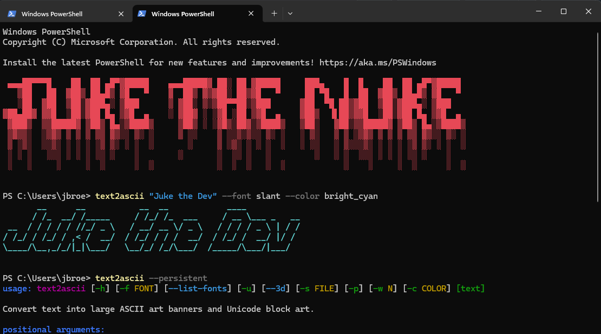

# text2ascii

```text
  _____________  ________   ___      ___   _____ ______________
 /_  __/ ____/ |/ /_  __/  |__ \    /   | / ___// ____/  _/  _/
  / / / __/  |   / / /     __/ /   / /| | \__ \/ /    / / / /
 / / / /___ /   | / /     / __/   / ___ |___/ / /____/ /_/ /
/_/ /_____//_/|_|/_/     /____/  /_/  |_/____/\____/___/___/
```

Convert any text into large ASCII art banners (figlet-style) and chunky Unicode block letters. Works as a CLI tool and as a retro single-page website.



---

## Installation

**Requires Python 3.9+**

```bash
pip install git+https://github.com/jbrodev/text2ascii.git
```

This installs the `text2ascii` command globally.

**For development:**

```bash
git clone https://github.com/jbrodev/text2ascii.git
cd text2ascii
pip install -e .
```

---

## CLI Usage

```
text2ascii "Your Text Here"
```

### Options

| Flag | Short | Description |
|------|-------|-------------|
| `--font NAME` | `-f` | Figlet font (default: `standard`) |
| `--list-fonts` | | List all available fonts |
| `--unicode` | `-u` | Use Unicode block characters (█) |
| `--save FILE` | `-s` | Save output to a text file |
| `--persistent` | `-p` | Print instructions to add banner to shell startup |
| `--width N` | `-w` | Max width in characters (default: terminal width) |
| `--color NAME` | `-c` | Colorize output (see colors below) |
| `--rainbow` | `-r` | Full-spectrum rainbow gradient |
| `--pattern THEME` | `-P` | Generate a random ASCII art scene |
| `--list-patterns` | | List available scene themes |
| `--height N` | `-H` | Scene height for `--pattern` (default: terminal height) |

**Available colors:** `red`, `green`, `yellow`, `blue`, `magenta`, `cyan`, `white`,
`bright_red`, `bright_green`, `bright_yellow`, `bright_blue`, `bright_magenta`, `bright_cyan`, `bright_white`, `rainbow`

> `--color rainbow` and `--rainbow` are interchangeable.

**Available pattern themes:**

| Theme | Description |
|-------|-------------|
| `starry-night` | Night sky with stars, a moon, shooting stars, and a silhouette horizon |
| `garden` | Sun, clouds, flowers with stems and leaves, butterflies |
| `storm` | Storm clouds, rain, lightning bolts, puddles |
| `forest` | Trees of varying heights, ground cover, day or night sky |
| `ocean` | Waves, fish, a sailboat, horizon line, sea floor |
| `random` | Picks one of the above at random each time |

> Every press generates a unique variation — no two scenes are the same.

### Examples

```bash
# Basic usage
text2ascii "Hello World"

# Different font
text2ascii "Hello" --font slant

# Unicode block art
text2ascii "Hi" --unicode

# Colored output
text2ascii "Hello" --font doom --color cyan

# Rainbow gradient
text2ascii "Hello" --color rainbow
text2ascii "Hello" --rainbow

# Pattern scenes
text2ascii --pattern starry-night
text2ascii --pattern random --rainbow
text2ascii --list-patterns

# Save to file
text2ascii "Hello" --save banner.txt

# Show all fonts
text2ascii --list-fonts

# Read from stdin
echo "Hello" | text2ascii -

# Persistent banner instructions
text2ascii "Hello World" --persistent
```

### Example Output

```text
  _   _      _ _        __        __         _     _ _
 | | | | ___| | | ___   \ \      / /__  _ __| | __| | |
 | |_| |/ _ \ | |/ _ \   \ \ /\ / / _ \| '__| |/ _` | |
 |  _  |  __/ | | (_) |   \ V  V / (_) | |  | | (_| |_|
 |_| |_|\___|_|_|\___/     \_/\_/ \___/|_|  |_|\__,_(_)
```

---

## Making a Banner Permanent

Run with `--persistent` to get platform-specific instructions:

```bash
text2ascii "Hello World" --font doom --persistent
```

This will print the exact command to add to your shell startup file (`~/.bashrc`, `~/.zshrc`, or PowerShell profile). The tool never modifies any files automatically.

**Manual method** — add to your shell startup file:

```bash
# In ~/.bashrc or ~/.zshrc
text2ascii "Hello World" --font doom
```

Reload your shell:

```bash
source ~/.bashrc   # Linux
source ~/.zshrc    # macOS
```

---

## Website

**[jbrodev.github.io/text2ascii](https://jbrodev.github.io/text2ascii/)**

No install required. Open the site, type your text, pick a style and color, then hit Convert.

- Choose from **ASCII art** (15 fonts), **Unicode blocks**, or **Unicode 3D**
- Pick a color — previewed in the terminal, not the browser
- **Copy to clipboard** or **download as `.txt`**
- The **Terminal Commands** panel generates ready-to-paste commands for your shell:
  - Run once in your current session
  - Save permanently so it appears every time you open a terminal
  - Fix it if you accidentally added it twice

---

## Windows Notes

- Use **Windows Terminal** for best Unicode (█) support
- Recommended fonts: **Cascadia Code**, **Consolas**, or **Lucida Console**
- Git Bash, WSL, and PowerShell 7 all work well

---

## Custom Fonts

Drop any `.flf` figlet font file into the `fonts/` directory:

```
text2ascii/
└── fonts/
    └── myfont.flf
```

Then use it with:

```bash
text2ascii "Hello" --font myfont
```

Hundreds of free `.flf` fonts are available at [patorjk.com/software/taag](http://patorjk.com/software/taag) and the [figlet font archive](http://www.figlet.org/fontdb.cgi).

---

## License

MIT — see [LICENSE](LICENSE)
